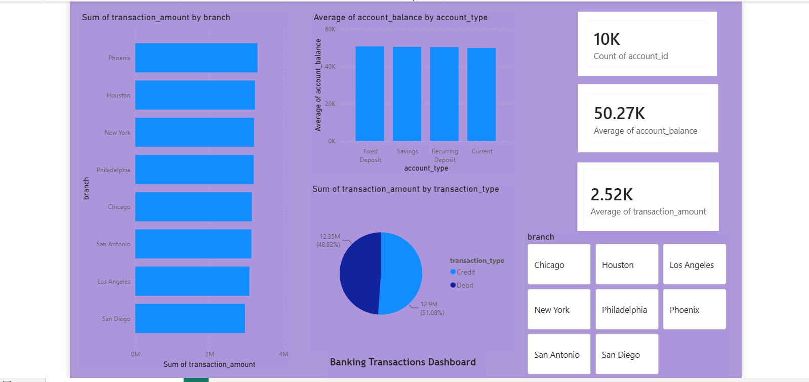

Banking Transactions Analysis — SQL + Power BI

A data analysis project exploring 10,000 banking transactions using MySQL for data storage and querying, and Power BI for interactive dashboard visualization.

📊 Project Overview

This project analyzes banking transaction data across 8 US branches, covering account types, transaction behavior, and balance patterns. Unlike a pure Python project, this one follows a more realistic analyst workflow: raw data → SQL database → SQL queries → BI dashboard.

Tech stack: MySQL, SQL, Power BI

🔍 Key Insights

Branch performance is balanced: Phoenix leads in total transaction volume (₹32.97L across 1,274 transactions), San Diego is lowest (₹29.59L) — all 8 branches fall within ~11% of each other.
Credit and Debit transactions are nearly identical in size: Credit averages ₹2,521.59 per transaction, Debit averages ₹2,527.68 — transaction type doesn't meaningfully affect amount.
Account balances are consistent across account types: Fixed Deposit holders carry the highest average balance (₹50,646), Current account holders the lowest (₹49,813) — a narrow ~2% spread.
~20% of transactions are high-value: 2,048 out of 10,000 transactions exceed ₹4,000, identified using SQL filtering.
5 of 8 branches handle above-average transaction volume (>1,250 transactions each), identified using GROUP BY + HAVING.

📁 Project Structure

banking-sql-analysis/
├── data/
│   └── banking_dataset.csv         # raw dataset (10,000 rows)
├── sql/
│   └── queries.sql                 # all SQL queries used in this project
├── banking_dashboard.pbix          # Power BI dashboard file
├── dashboard_screenshot.png        # dashboard preview image
└── README.md

🚀 How to Reproduce

Set up MySQL:

Create the database and table using the scripts in sql/queries.sql
Import data/banking_dataset.csv into the transactions table (via MySQL Workbench's Table Data Import Wizard)

Run the analysis queries:

Open sql/queries.sql in MySQL Workbench and run each query to reproduce the findings

Open the dashboard:

Open banking_dashboard.pbix in Power BI Desktop
Update the MySQL connection (Server: 127.0.0.1:3306, Database: banking_analysis) if needed
Click Refresh to pull live data

📈 Dashboard Preview

The dashboard includes:

Total transaction amount by branch (bar chart)
Average account balance by account type (column chart)
Credit vs Debit split (pie chart)
KPI cards: total accounts, average balance, average transaction amount
Interactive branch slicer for drill-down filtering

🎯 What I Learned

Setting up and querying a MySQL database from scratch
Core SQL: SELECT, WHERE, GROUP BY, HAVING, ORDER BY, and aggregate functions (SUM, AVG, COUNT)
The difference between filtering before grouping (WHERE) vs after grouping (HAVING)
Connecting Power BI directly to a live MySQL database (not just static file imports)
Building an interactive dashboard with cross-filtering slicers and KPI cards
Troubleshooting real-world setup issues: forgotten passwords, partial CSV imports, missing DB connectors

📝 Dataset

Source: Banking Dataset, Kaggle